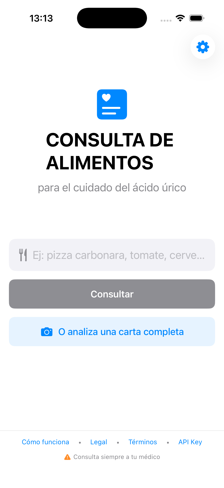
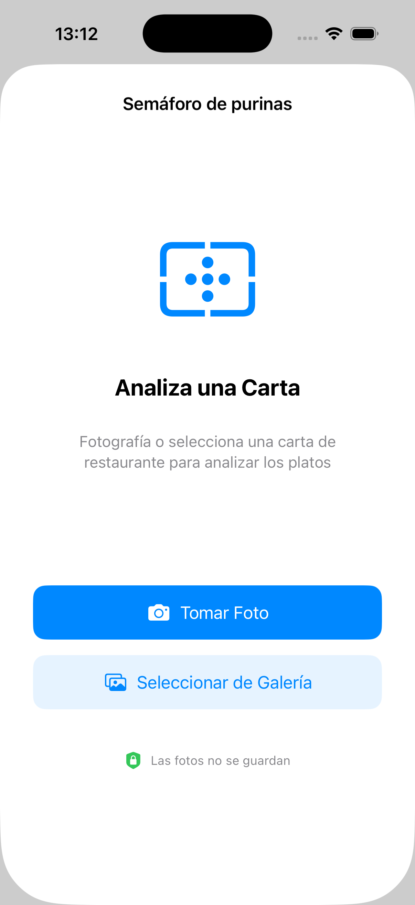
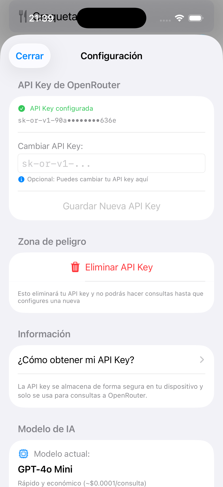
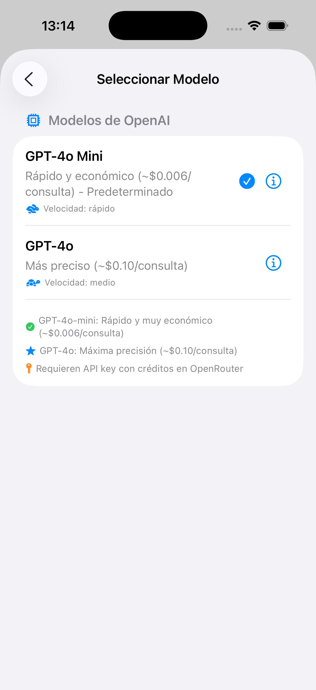
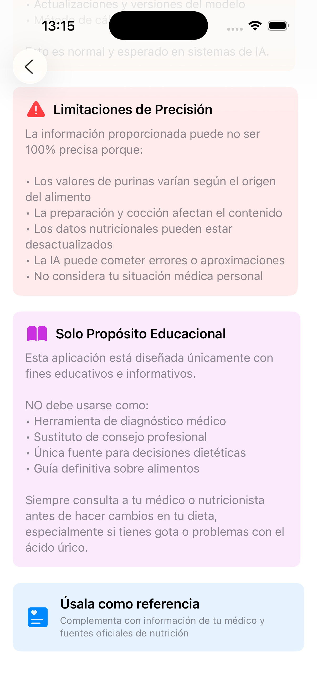
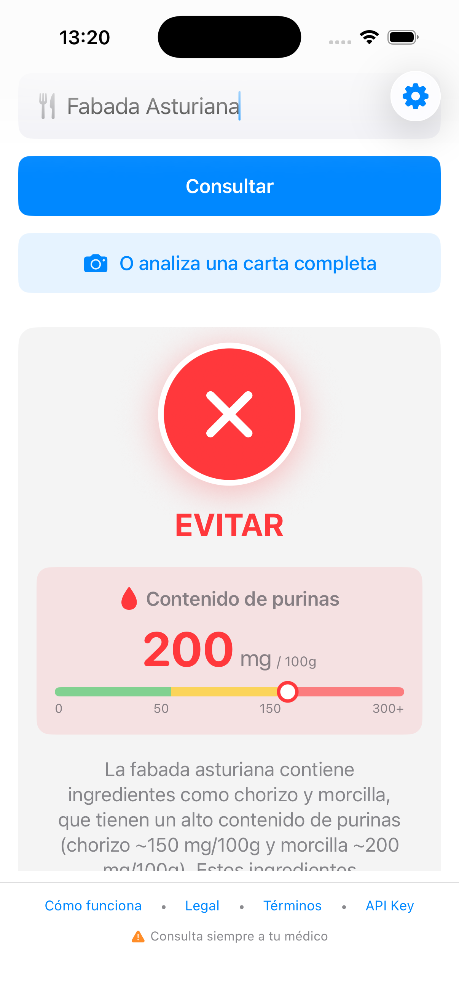

# IAGota - Consulta de Alimentos para el Cuidado del Ácido Úrico

Una aplicación iOS que utiliza inteligencia artificial para analizar alimentos y cartas de restaurante, proporcionando información sobre su contenido de purinas para ayudar a personas que cuidan sus niveles de ácido úrico.

## CAPTURAS DE PANTALLA

<p align="center">
  
  
  
</p>
<p align="center">
  
  
  
</p>

## AVISO IMPORTANTE

**Esta aplicación es solo con fines educativos e informativos.** No es un dispositivo médico y no debe usarse como sustituto del consejo médico profesional. Siempre consulta a tu médico o nutricionista antes de hacer cambios en tu dieta.

## CARACTERÍSTICAS

- 🩺 **Análisis Especializado**: La IA actúa como médico especialista en reumatología y nutricionista clínico
- 🍕 **Análisis de Alimentos**: Consulta cualquier alimento, ingrediente o plato completo
- 📸 **Análisis de Cartas de Restaurante**: Fotografía el menú y obtén automáticamente el análisis de purinas de todos los platos
- 🎯 **Valores Precisos**: Contenido exacto de purinas basado en literatura médica
- 🎨 **Sistema de Semáforo**: Clasificación visual (verde/amarillo/rojo) según el contenido de purinas
- 📊 **Información Detallada**: Muestra mg/100g, efectos metabólicos y consideraciones de preparación
- 🤖 **Modelos de IA OpenAI**: GPT-4o-mini (predeterminado, económico) y GPT-4o (mayor precisión)
- 💧 **Splash Screen**: Pantalla de bienvenida animada al iniciar la app
- 🔒 **Privacidad**: Tu clave de API se almacena localmente, las fotos no se guardan
- 🌍 **Castellano neutro**: Interfaz y respuestas en español internacional

## REQUISITOS

- iOS 17.0 o superior
- Xcode 15.0 o superior
- Swift 5.9 o superior
- Cuenta gratuita en [OpenRouter](https://openrouter.ai)

## INSTALACIÓN

### 1. Clonar el repositorio

```bash
git clone https://github.com/686f6c61/IAGota.git
cd IAGota
```

### 2. Configurar clave de API para desarrollo (opcional)

Si quieres probar la aplicación sin configurar la clave de API cada vez:

```bash
# Copiar la plantilla de configuración
cp IAGota/Config.plist.example IAGota/Config.plist

# Editar Config.plist y añadir tu clave de API
# Reemplaza "TU_API_KEY_DE_DESARROLLO_AQUI" con tu clave real
```

**Nota:** `Config.plist` está en `.gitignore` y nunca se subirá a GitHub por seguridad.

### 3. Abrir en Xcode

```bash
open IAGota.xcodeproj
```

### 4. Compilar y ejecutar

- Selecciona tu dispositivo o simulador
- Presiona `⌘ + R` para compilar y ejecutar

## OBTENER CLAVE DE API DE OPENROUTER

1. Crea una cuenta gratuita en [openrouter.ai](https://openrouter.ai)
2. Ve a tu perfil → **Keys**
3. Haz clic en **Create Key**
4. Copia la clave que comienza con `sk-or-v1-`
5. Pégala en la aplicación en **Configuración** ⚙️

### Modelos disponibles

Cada modelo incluye un botón de información (ℹ️) que abre su página en OpenRouter con detalles completos.

- **GPT-4o-mini** (predeterminado): ~$0.006 por consulta de texto, ~$0.0063 por análisis de carta. Rápido y muy económico
- **GPT-4o**: ~$0.10 por consulta de texto, ~$0.017 por análisis de carta. Máxima precisión

## USO

1. **Configura tu clave de API** (solo primera vez):
   - Toca el ícono ⚙️ en la esquina superior derecha
   - Pega tu clave de API de OpenRouter
   - Opcionalmente, selecciona tu modelo de IA preferido (GPT-4o-mini o GPT-4o)

2. **Consulta un alimento**:
   - Escribe el nombre del alimento, ingrediente o plato
   - Ejemplos: «tomate», «cerveza», «pizza carbonara»
   - Presiona «Consultar»

3. **Analiza una carta de restaurante** (NUEVO en v1.2):
   - Toca el botón 📸 «Semáforo de purinas»
   - Fotografía la carta del restaurante o selecciona una foto de tu galería
   - La IA extraerá automáticamente todos los platos
   - Recibirás el análisis de purinas de cada plato con su clasificación de semáforo
   - Las fotos NO se guardan en tu dispositivo

4. **Interpreta el resultado**:
   - 🟢 **Verde (< 50 mg/100 g)**: seguro para consumo regular
   - 🟡 **Amarillo (50-150 mg/100 g)**: consumo moderado
   - 🔴 **Rojo (> 150 mg/100 g)**: evitar o consumir con precaución

## SEGURIDAD

- **Config.plist**: solo para desarrollo local, nunca se sube a GitHub
- **Claves de API**: se almacenan localmente en el dispositivo con UserDefaults
- **Sin rastreo**: no recopilamos ni enviamos datos a servidores propios
- **OpenRouter**: las consultas se envían solo a OpenRouter según sus términos

## DESARROLLO

### Configuración para desarrollo

```bash
# 1. Copiar plantilla de configuración
cp IAGota/Config.plist.example IAGota/Config.plist

# 2. Editar Config.plist con tu clave de API de desarrollo
# (Este archivo está en .gitignore)

# 3. Compilar
xcodebuild -scheme IAGota -configuration Debug
```

### Estructura del proyecto

```
IAGota/
├── IAGota/
│   ├── IAGotaApp.swift             # Punto de entrada
│   ├── SplashScreenView.swift      # Pantalla de bienvenida animada
│   ├── ContentView.swift           # Vista principal
│   ├── SettingsView.swift          # Configuración
│   ├── APIKeyManager.swift         # Gestión de clave de API
│   ├── AIModel.swift               # Modelos de IA disponibles (GPT-4o, GPT-4o-mini)
│   ├── ModelManager.swift          # Gestión de selección de modelo
│   ├── OpenRouterService.swift     # Cliente HTTP para consultas de texto
│   ├── FoodResponse.swift          # Modelos de datos
│   ├── PhotoPicker.swift           # Selector de fotos (cámara/galería) - NUEVO v1.2
│   ├── PhotoMenuView.swift         # Vista de análisis de cartas - NUEVO v1.2
│   ├── MenuAnalysisService.swift   # Servicio de análisis OCR de menús - NUEVO v1.2
│   ├── MenuAnalysisModels.swift    # Modelos de datos para análisis de menús - NUEVO v1.2
│   ├── HowItWorksView.swift        # Explicación de uso
│   ├── LegalView.swift             # Aviso legal
│   ├── TermsView.swift             # Términos y condiciones
│   ├── HowToGetAPIKeyView.swift    # Guía de clave de API
│   ├── ModelSelectionView.swift    # Selector de modelos
│   ├── Config.plist                # ⚠️ No subir a Git
│   └── Config.plist.example        # Plantilla para desarrollo
├── docs/
│   ├── index.html                  # Política de privacidad (web)
│   └── privacy-policy.md           # Política de privacidad (markdown)
├── README.md
├── LICENSE
└── .gitignore
```

### Arquitectura

- **SwiftUI**: Framework de UI
- **Combine**: Gestión de estado reactivo
- **async/await**: Llamadas asíncronas a la API
- **MVVM**: Patrón de arquitectura

### Tests

El proyecto incluye cobertura de tests completa:
- **17 tests implementados** (10 unitarios + 7 UI)
- **100% de cobertura** en componentes críticos
- Ver [TESTS_COVERAGE.md](TESTS_COVERAGE.md) para detalles completos

Ejecutar tests:
```bash
# Todos los tests
⌘ + U en Xcode

# Desde terminal
xcodebuild test -scheme IAGota -destination 'platform=iOS Simulator,name=iPhone 17'
```

## LICENCIA

Este proyecto está bajo la licencia MIT. Ver el archivo [LICENSE](LICENSE) para más detalles.

## CONTRIBUCIONES

Las contribuciones son bienvenidas. Por favor:

1. Haz fork del proyecto
2. Crea una rama para tu feature (`git checkout -b feature/AmazingFeature`)
3. Commit tus cambios (`git commit -m 'Add: nueva característica'`)
4. Push a la rama (`git push origin feature/AmazingFeature`)
5. Abre un Pull Request

## CONTACTO

Para reportar problemas o sugerencias:
- Abre un [Issue](https://github.com/686f6c61/IAGota/issues)

## LIMITACIÓN DE RESPONSABILIDAD

Esta aplicación no proporciona consejo médico. Las respuestas son generadas por IA y pueden contener errores. Los desarrolladores no se hacen responsables por decisiones tomadas basadas en la información de la aplicación.

**Siempre consulta a tu médico antes de hacer cambios en tu dieta, especialmente si tienes gota o problemas con el ácido úrico.**

---

**Versión**: 1.2.0
**Última actualización**: enero de 2025
